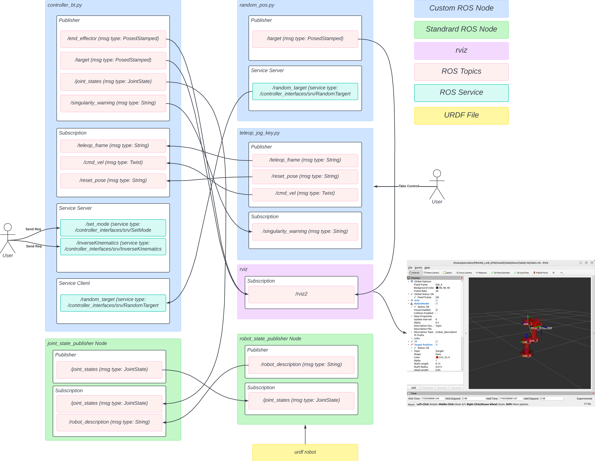
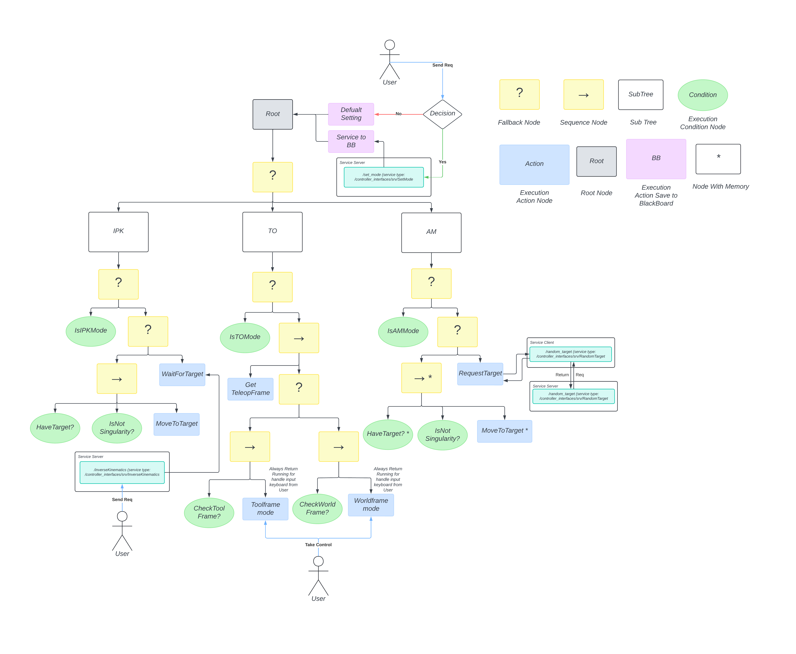
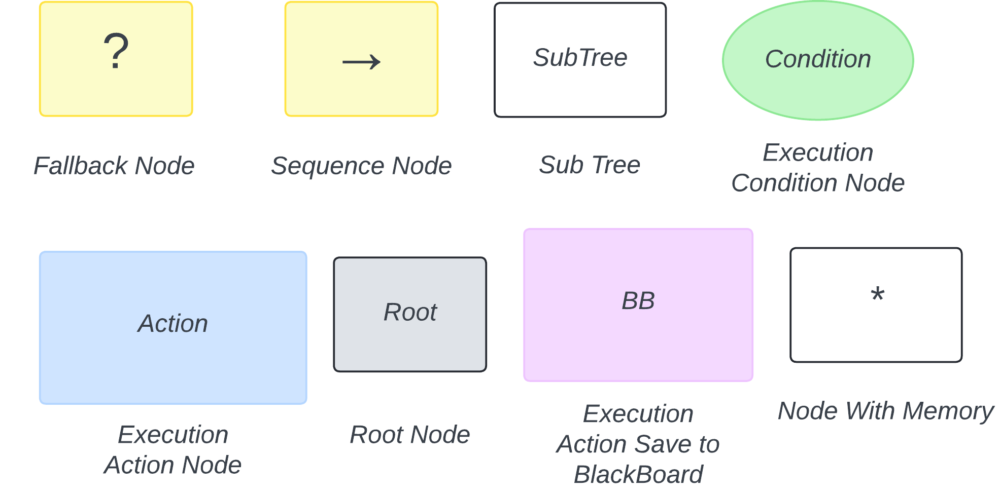

# FRA502-LAB-6703
Peeradon Ruengkaew 6703 (Moke)

## Table of Contents
- [Demo Video](#demo-video)
- [System Architecture](#system-architecture)
  - [System Architecture Explanation](#system-architecture-explanation)
- [Behavior Tree](#behavior-tree)
  - [Node Descriptions](#node-descriptions)
  - [Behavior Tree Flow Explanation](#behavior-tree-flow-explanation)
- [Installation](#installation)
- [Usage](#usage)


## Demo Video


For better view please visit [demo_video.mp4](./images/demo.mp4)

## System Architecture


For better view please visit [system_architecture.pdf](./system_architecture.pdf)

### System Architecture Explanation:

The system consists of three custom ROS nodes and several standard ROS nodes working together:

#### Custom ROS Nodes:

**1. controller_bt.py** (Main Controller Node)
- **Publishers**:
  - `/end_effector` (PoseStamped): Publishes current end effector position
  - `/joint_states` (JointState): Publishes current joint states
  - `/target` (PoseStamped): Publishes target positions for visualization
  - `/singularity_warning` (String): Publishes warnings when approaching singularity
- **Subscribers**:
  - `/teleop_frame` (String): Receives frame selection (tool/world) from teleop node
  - `/cmd_vel` (Twist): Receives velocity commands for teleoperation mode
  - `/reset_pose` (String): Receives reset commands to return to initial pose
- **Service Servers**:
  - `/set_mode` (SetMode): Switches between IPK, TO, and AM modes
  - `/inverseKinematics` (InverseKinematics): Calculates IK solutions for target poses
- **Service Clients**:
  - `/random_target` (RandomTarget): Requests random target positions in AM mode

**2. random_pos.py** (Random Target Generator)
- **Publishers**:
  - `/target` (PoseStamped): Publishes random target positions within workspace
- **Service Servers**:
  - `/random_target` (RandomTarget): Provides random valid target positions upon request

**3. teleop_jog_key.py** (Keyboard Teleoperation Interface)
- **Publishers**:
  - `/teleop_frame` (String): Publishes selected reference frame (tool/world)
  - `/cmd_vel` (Twist): Publishes velocity commands from keyboard input
  - `/reset_pose` (String): Publishes reset commands when 'r' key is pressed
- **Subscribers**:
  - `/singularity_warning` (String): Receives and displays singularity warnings to user

#### Standard ROS Nodes:

**4. joint_state_publisher Node**
- **Publishers**: `/joint_states` (JointState)
- **Subscribers**: `/joint_states` (JointState)
- Manages joint state information

**5. robot_state_publisher Node**
- **Publishers**: `/joint_states` (JointState)
- **Subscribers**: `/robot_description` (String)
- Publishes robot transforms based on URDF and joint states

**6. RViz**
- **Subscribers**: `/rviz2`
- Visualization tool for robot state and targets

#### Data Flow:

1. **User → System**: User sends service requests to change modes or move the robot
2. **Controller ↔ Services**: Controller node handles all service requests and mode switching
3. **Teleop → Controller**: Keyboard commands are converted to velocity commands
4. **Controller → Visualization**: Joint states and positions are published to RViz
5. **URDF → robot_state_publisher → RViz**: Robot model visualization pipeline

## Behavior Tree
The behavior tree used in this lab is designed to manage the robot arm's movement and control logic:



For better view please visit [bt.pdf](./bt.pdf)

### Node Descriptions:



**Node Type Explanations:**

- **Fallback Node (?)**: Executes children from left to right until one succeeds. Returns success if any child succeeds, failure if all children fail. Used for selecting between alternative behaviors.

- **Sequence Node (→)**: Executes children from left to right until one fails. Returns success only if all children succeed, failure if any child fails. Used for sequential task execution.

- **SubTree**: Represents a separate behavior tree that can be reused. Encapsulates complex behaviors into modular components.

- **Condition Node (green oval)**: Checks a specific condition or state. Returns success if the condition is true, failure otherwise. Examples: `IsIPKMode`, `HaveTarget?`, `IsNot Singularity?`

- **Action Node (blue rectangle)**: Performs a specific task or action. Returns success, failure, or running status based on task completion. Examples: `MoveToTarget`, `RequestTarget`, `TeleopFrame`

- **Root Node (gray rectangle)**: The starting point of the behavior tree. The tree execution begins here and ticks through all connected nodes.

- **BB (BlackBoard - pink rectangle)**: A shared memory space where nodes can read and write data. Used for communication between different parts of the behavior tree.

- **Node With Memory (*)**: Indicates nodes that remember their previous state across ticks. Useful for maintaining context in ongoing operations.

More detail please visit [py_tree_documentation](https://py-trees.readthedocs.io/en/devel/)

### Behavior Tree Flow Explanation:

Based on the behavior tree diagram above, the system operates with three main control modes, selected through a root fallback node:

#### 1. IPK Mode (Inverse Position Kinematics)
- **Trigger**: Activated when `IsIPKMode` condition is true
- **Flow**:
  - Checks if a target position is available (`HaveTarget?`)
  - Verifies the robot is not in singularity state (`IsNot Singularity?`)
  - Executes `MoveToTarget` to move the end effector to the desired position
  - If no target is available, waits using `WaitForTarget`
- **Service**: Uses `/inverseKinematics` service to calculate joint configurations
- **Behavior**: Returns success if IK solution exists and robot moves successfully, otherwise returns failure and stays in place

#### 2. TO Mode (Teleoperation)
- **Trigger**: Activated when `IsTOMode` condition is true
- **Flow**:
  - Monitors velocity commands from `/cmd_vel` topic
  - Checks the current reference frame using `TeleopFrame`
  - Switches between two control modes:
    - `CheckTool Frame?` → `Toolframe mode`: Velocity commands relative to end effector frame
    - `CheckWorld Frame?` → `Worldframe mode`: Velocity commands relative to world frame
- **Safety**: Monitors singularity conditions and publishes warnings to `/singularity_warning` topic when approaching singular configurations
- **User Control**: Accepts keyboard input through `teleop_jog_key.py` node

#### 3. AM Mode (Auto Mode)
- **Trigger**: Activated when `IsAMMode` condition is true
- **Flow**:
  - Sends service request to `random_pose` node via `RequestTarget` action
  - Waits for random target response (`HaveTarget?`)
  - Checks singularity safety (`IsNot Singularity?`)
  - Moves to the target position using `MoveToTarget` with 10-second timeout
  - Upon successful arrival, loops back to request a new random target
- **Service**: Uses `/random_target` service for continuous target generation
- **Behavior**: Continuously moves between random positions within the workspace


## Installation 

1. Clone the repository at branch LAB4

```bash
git clone https://github.com/peeradonmoke2002/FRA502_LAB_6703.git -b LAB4
```

2. Navigate to the cloned repository and install dependencies

```bash
cd FRA502_LAB_6703
sudo apt update && sudo apt upgrade
rosdep update
rosdep install -y --from-paths src --ignore-src --rosdistro $ROS_DISTRO
```

2.1. Since this repository uses behavior tree (py_tree) to manage state, please install the following packages

```bash
sudo apt install \
    ros-humble-py-trees \
    ros-humble-py-trees-ros-interfaces \
    ros-humble-py-trees-ros \
    ros-humble-py-trees-ros-tutorials \
    ros-humble-py-trees-ros-viewer   
```

or if you face any issues, please clone this repo [py_tree_ros](https://github.com/splintered-reality/py_trees_ros.git) and [py_tree_viewer](https://github.com/splintered-reality/py_trees_ros_viewer.git)


3. Build the workspace **(please ensure you are in the workspace folder; if not, please cd to the workspace folder)**

```bash
colcon build --symlink-install
```

4. Source the workspace

```bash
source install/setup.bash
```

Alternatively, you can add this line to your `~/.bashrc` file to source the workspace automatically when you open a new terminal.

```bash
echo "source ~/FRA502_LAB_6703/install/setup.bash" >> ~/.bashrc
source ~/.bashrc
```

## Usage

### Starting the System

1. Launch lab4 launch file:

```bash
ros2 launch lab4 lab4.launch.py
```

You should see the following in RViz2:


2. In another terminal, run the following command to start the teleop node:

```bash
ros2 run lab4 teleop_jog_key.py
```

The output should be like this:

```bash
Control Your Robot Arm!
---------------------------
Moving around:
   w
 a s d

w/s : increase/decrease x velocity
a/d : increase/decrease y velocity
q/e : increase/decrease z velocity

f : toggle frame (world/tool)
r : reset to initial pose
space : stop all motion
x : exit

Current velocities will be displayed

Speed: 0.1 m/s
Frame: tool
```


3. (Optional) Run rqt_service_caller for GUI-based service control:

```bash
cd ~/FRA502_LAB_6703
source install/setup.bash
ros2 run rqt_service_caller rqt_service_caller
```

You should see the following window:


4. (Optional) Run py_tree viewer to see the behavior tree status:

```bash
py-trees-ros-viewer
```
You should see the following window:


### Controlling the Robot

The robot can be controlled through three different modes using the `/set_mode` service. Below are examples of how to use each mode:

#### 1. IPK Mode (Inverse Position Kinematics)

To switch to IPK mode and send a target position:

**Step 1:** Set mode to IPK
```bash
ros2 service call /set_mode controller_interfaces/srv/SetMode "{mode: 'IPK'}"
```

**Step 2:** Send target position using the inverse kinematics service
```bash
ros2 service call /inverseKinematics controller_interfaces/srv/InverseKinematics "{x: 0.3, y: 0.2, z: 0.4}"
```

**Expected Behavior:**
- If IK solution exists: Robot moves to the target position, service returns `success: true` with joint configurations
- If IK solution doesn't exist: Robot stays in place, service returns `success: false`

#### 2. TO Mode (Teleoperation)

To switch to Teleoperation mode:

```bash
ros2 service call /set_mode controller_interfaces/srv/SetMode "{mode: 'TO'}"
```

**Expected Behavior:**
- Robot switches to teleoperation mode
- You can now control the robot using keyboard commands from the `teleop_jog_key.py` node
- Use 'w/a/s/d/q/e' keys to move the end effector
- Press 'f' to toggle between tool frame and world frame
- If approaching singularity, robot stops and publishes warning to `/singularity_warning` topic

#### 3. AM Mode (Auto Mode)

To switch to Auto mode:

```bash
ros2 service call /set_mode controller_interfaces/srv/SetMode "{mode: 'AM'}"
```

**Expected Behavior:**
- Robot automatically requests random target positions from `random_pos` node
- Moves to each target within 10 seconds
- Continuously loops to new random targets within the workspace
- Checks for singularity before each movement

#### Alternative: Using rqt_service_caller (GUI Method)

Alternatively, you can use the rqt_service_caller GUI to control the robot:

1. Select the service from the dropdown menu (e.g., `/set_mode` or `/inverseKinematics`)
2. Fill in the required parameters in the GUI form
3. Click "Call" button to execute the service
4. View the response in the output panel

#### Monitoring the System

- **Behavior Tree Status**: Use `py-trees-ros-viewer` to visualize the current state of the behavior tree
- **Joint States**: Monitor `/joint_states` topic to see current joint positions
- **End Effector Position**: Monitor `/end_effector` topic to see current end effector pose
- **Target Position**: Monitor `/target` topic to see the current target position
- **Singularity Warnings**: Monitor `/singularity_warning` topic for safety alerts
