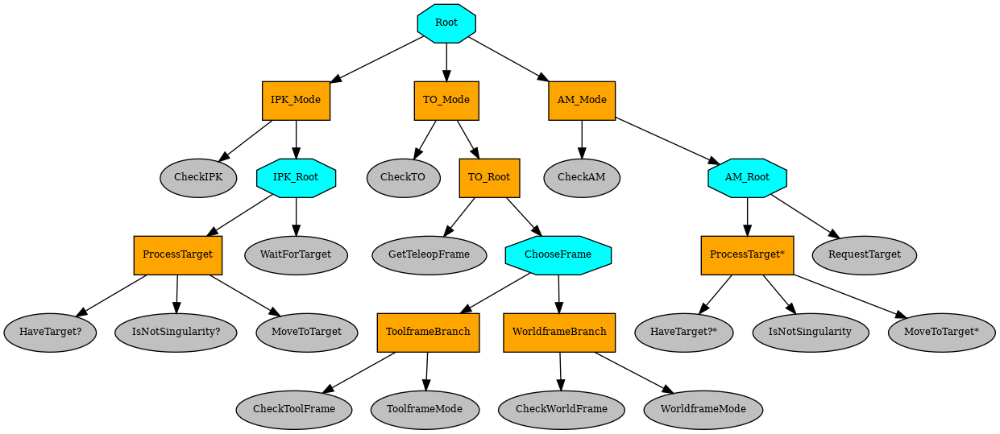
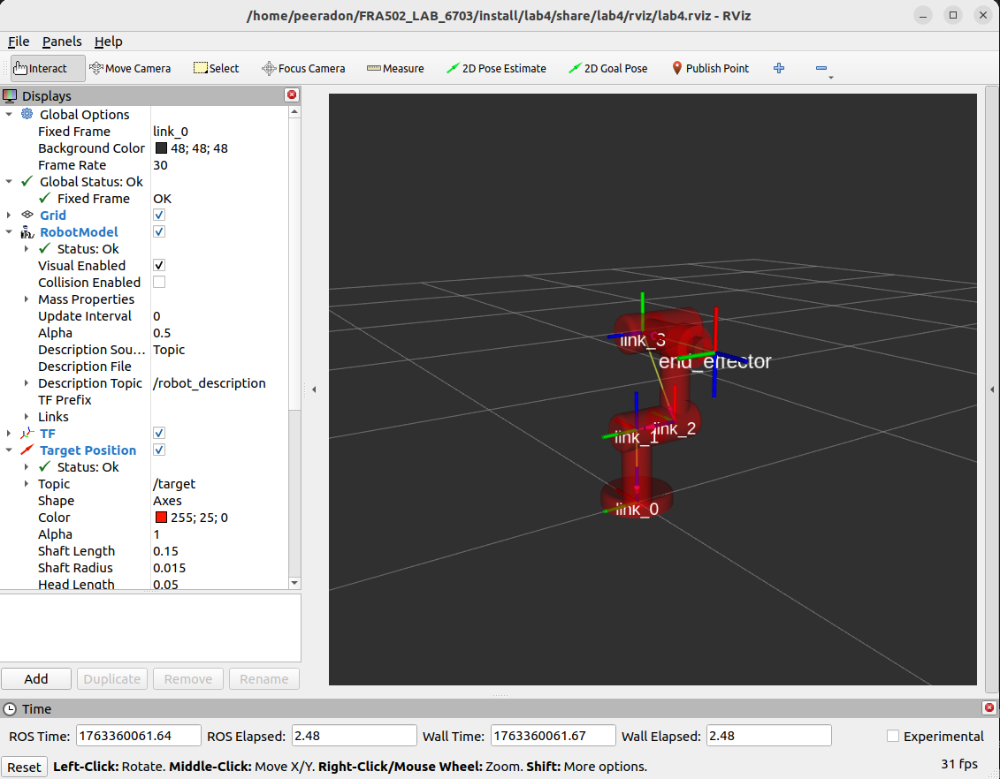
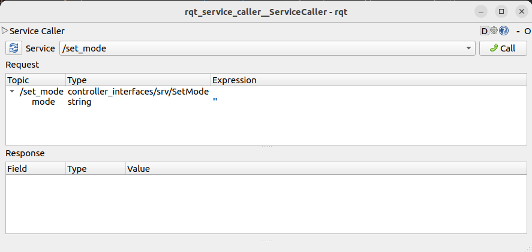
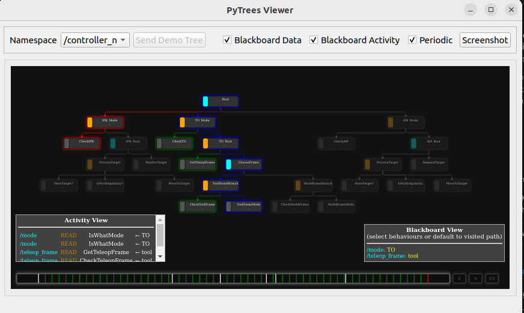

# FRA502-LAB-6703
Peeradon Ruengkaew 6703 (Moke)

## Table of Contents
- [System Architecture](#system-architecture)
- [Installation](#installation)
- [Usage](#usage)


## System Architecture
Comming soon...


## Behavior Tree Diagram
The behavior tree used in this lab is designed to manage the robot arm's:




## Installation 

1. Clone the repository at branch LAB4

```bash
git clone https://github.com/peeradonmoke2002/FRA502_LAB_6703.git -b LAB4
```

2. Navigate to the cloned repository and Install dependencies

```bash
cd FRA502_LAB_6703
sudo apt update && sudo apt upgrade
rosdep update
rosdep install -y --from-paths src --ignore-src --rosdistro $ROS_DISTRO
```

2.1. Due to this repository use behavior tree (py_tree) to manage state, please install the following package

```bash
sudo apt install \
    ros-humble-py-trees \
    ros-humble-py-trees-ros-interfaces \
    ros-humble-py-trees-ros \
    ros-humble-py-trees-ros-tutorials \
    ros-humble-py-trees-ros-viewer   
```

or if face any issue please this repo [py_tree_ros](https://github.com/splintered-reality/py_trees_ros.git) and [py_tree_viewer](https://github.com/splintered-reality/py_trees_ros_viewer.git)


3. Build the workspace **(please be ensure you in workspace folder if not please cd to workspace folder)**

```bash
colcon build --symlink-install
```

4. Source the workspace

```bash
source install/setup.bash
```

However, you can add this line to your `~/.bashrc` file to source the workspace automatically when you open a new terminal.

```bash
echo "source ~/FRA502_LAB_6703/install/setup.bash" >> ~/.bashrc
source ~/.bashrc
```

## Usage
1. Launch lab4 launch file:

```bash
ros2 launch lab4 lab4.launch.py 
```

You should see rviz2 show:



2. In another terminal, run the following command to start the teleop node:

```bash
ros2 run lab4 teleop_jog_key.py 
```

the output should be like this:

```bash
Control Your Robot Arm!
---------------------------
Moving around:
   w
 a s d

w/s : increase/decrease x velocity
a/d : increase/decrease y velocity
q/e : increase/decrease z velocity

f : toggle frame (world/tool)
r : reset to initial pose
space : stop all motion
x : exit

Current velocities will be displayed

Speed: 0.1 m/s
Frame: tool
```


3. Next run rqt_service to call to control robot from servcie base form requirement at [LAB4.pdf](./LAB4.pdf) :

```bash
cd ~/FRA502_LAB_6703
source install/setup.bash
ros2 run rqt_service_caller rqt_service_caller 
```

You should see the following window:


4. And run py_tree viewer to see the behavior tree status:

```bash
py-trees-ros-viewer 
```
You should see the following window:


